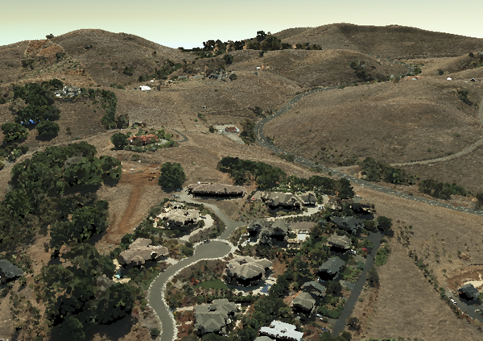

== Point Cloud Scene Layer

=== Introduction

Point cloud scene layers quickly display large volumes of symbolized and filtered point cloud data. They are optimized 
for the displaying and sharing a variety of sensor data, including LiDAR.  

Point cloud scene layers are scalable, which allows for efficiency when working with large datasets.  While rendering 
very large point cloud datasets can be slow and limited by hardware, point cloud scene layers are efficient because they 
are rendered at an optimized point resolution for the specified area. 

Point cloud scene layers also support caching attributes like RGB, Intensity, Flags, Class Code, Returns, User Data, 
Point Source ID, GPS Time, Scan Angle and Near Infrared.  This allows client applications to update the symbology as 
well as query point information.

[#img_pointcloud,reftext='{figure-caption} {counter:figure-num}']
.Example of point cloud rendering


=== Point Cloud Scene Layer Structure

The point cloud scene layer is structured into a tree of multiple JSON files. Beside storing information in the JSON format, 
some are also provided as binary buffer. Point cloud scene layers can be used to create a scene layer package (*.slpk) or a 
I3S service. Since an *.slpk file can contain millions of documents, an [SLPK hash table](slpk_hash_table.pcsl.md) improves 
performance when scanning the slpk. A point cloud scene layer contains the following:

- [Layer description](layer.pcsl.md)
- Nodes containing [Geometry](defaultGeometrySchema.pcsl.md) and [Attributes](attributeInfo.pcsl.md)
- [Node pages](nodepage.pcsl.md)
- [Statistics](statistics.pcsl.md)

=== Example of point cloud layer structure

```
.<host>/SceneServer/layers
	+--0 // layer description (named 3dSceneLayer.json in SLPK)
	+-- nodepages
	|  +-- 0
	|  +-- 1   
	|  +-- 2  
	|  +-- (...)
	|  +-- 4  
	+-- nodes
	|  +--0
	|  |  +-- attributes
	|  |  |  +--2 
	|  |  |  +--4
	|  |  |  +--8
	|  |  |  +--(...)
	|  |  +-- geometries
	|  |  |  +-- 0
	|  +--1 
	|  |  (...) //same structure for all nodes
	|  +--...
	|  +-- 259
	|  |  (...) //same structure for all nodes
	+--statistics
	|  +-- 2
	|  +-- 4
	|  +-- 8
	|  +-- (...)
```
=== HTTP API Overview

The following API methods are available for accessing a point cloud scene layer:

[width="90%",options="header"]
|===
|Method|Example
|To query SceneLayer document|http://my.server.com/layers/0
|To query attribute, statistics, documents|http://my.server.com/layers/0/statistics/{AttribKey}
|To query  NodePage  document|http://my.server.com/layers/0/nodepages/{firstNodeIdInPage} 
|To query  Geometry  Buffer|http://my.server.com/layers/0/nodes/{resourceID}/geometries/0 
|To query  Attribute  Buffer|http://my.server.com/layers/0/nodes/{resourceID}/attributes/{AttribKey}  _Note:  {AttribKey}  is listed in  `layer.attributeStorageInfo[].key`
|===

=== I3S point cloud scene layer definition

Describes the point cloud scene layer.

==== Related to:

Point Cloud Class relations

Class nodepage (pcsl), Class statistics (pcsl), store (pcsl), attributeInfo (pcsl), drawingInfo (pcsl), elevationInfo (pcsl)

Core Class relations

spatialReference, heightModelInfo, serviceUpdateTimeStamp, fields

==== Properties

[width="90%",options="header"]
|===
| Property | Type | Description 
| **id** | integer | A unique identifying number for the layer. For point cloud scene layer, only a single layer is supported, therefore, id is always 0.
| **layerType** | string | String indicating the layer type<div>Must be:<ul><li>`PointCloud`</li></ul></div> 
| **name** | string | Represents the layer name. 
| alias | string | Represents the alias layer name. 
| desc | string | Description for the layer. 
| copyrightText | string | Copyright information to be displayed with this layer. 
| capabilities | string[] | Capabilities supported by this layer.<div>Possible values for each array string:<ul><li>`View`: View is supported.</li><li>`Query`: Query is supported.</li></ul></div> 
| **spatialReference** | [spatialReference](spatialReference.cmn.md) | An object containing the WKID or WKT identifying the spatial reference of the layer's geometry. 
| heightModelInfo | [heightModelInfo](heightModelInfo.cmn.md) | An object containing the vertical coordinate system information. 
| serviceUpdateTimeStamp | [serviceUpdateTimeStamp](serviceUpdateTimeStamp.cmn.md) | Object to provide time stamp when the I3S service or the source of the service was created or updated. 
| **store** | [store](store.pcsl.md) | The storage for the layer. 
| **attributeStorageInfo** | [attributeInfo](attributeInfo.pcsl.md)[] | List of attributes included for this layer. 
| drawingInfo | [drawingInfo](drawingInfo.pcsl.md) | An object containing drawing information. 
| elevationInfo | [elevationInfo](elevationInfo.pcsl.md) | An object containing elevation information. 
| fields | [field](field.cmn.md)[] |  |
|===

*Note: properties in **bold** are required*

==== Example: Point cloud layer 

```json
 {
    "id": 0,
    "layerType": "PointCloud",
    "name": "Test Data",
    "desc": "Nice Test data",
    "capabilities": [
      "View"
    ],
    "spatialReference": {
        "wkid": 4326,
        "latestWkid": 4326,
        "vcsWkid": 5703,
        "latestVcsWkid": 5703
    },
    "store": {
        "id": "",
        "profile": "PointCloud",
        "version": "2.0",
        "extent": [
            -122.45945212669568,
            38.298060753040346,
            -122.43014691292728,
            38.303939889306761
        ],
        "index": {
            "nodeVersion": 1,
            "boundingVolumeType": "obb",
            "nodesPerPage": 64,
            "lodSelectionMetricType": "density-threshold"
        },
        "defaultGeometrySchema": {
            "geometryType": "points",
            "header": [],
            "topology": "PerAttributeArray",
            "encoding": "lepcc-xyz",
            "vertexAttributes": {
                "position": {
                    "valueType": "Float64",
                    "valuesPerElement": 3
                }
            },
            "ordering": [
                "position"
            ]
        }
    },
    "attributeStorageInfo": [
        {
            "key": "1",
            "name": "ELEVATION",
            "encoding": "embedded-elevation"
        },
        {
            "key": "2",
            "name": "INTENSITY",
            "ordering": [
                "attributeValues"
            ],
            "attributeValues": {
                "valueType": "UInt16",
                "valuesPerElement": 1
            },
            "encoding": "lepcc-intensity"
        },
        {
            "key": "4",
            "name": "RGB",
            "ordering": [
                "attributeValues"
            ],
            "attributeValues": {
                "valueType": "UInt8",
                "valuesPerElement": 3
            },
            "encoding": "lepcc-rgb"
        },
        {
            "key": "8",
            "name": "CLASS_CODE",
            "ordering": [
                "attributeValues"
            ],
            "attributeValues": {
                "valueType": "UInt8",
                "valuesPerElement": 1
            }
        },
        {
            "key": "16",
            "name": "FLAGS",
            "ordering": [
                "attributeValues"
            ],
            "attributeValues": {
                "valueType": "UInt8",
                "valuesPerElement": 1
            }
        },
        {
            "key": "32",
            "name": "RETURNS",
            "ordering": [
                "attributeValues"
            ],
            "attributeValues": {
                "valueType": "UInt8",
                "valuesPerElement": 1
            }
        }
    ],
    "drawingInfo": {
        "renderer": {
            "pointSizeAlgorithm": {
                "type": "pointCloudSplatAlgorithm",
                "scaleFactor": 1,
                "minSize": 4
            },
            "pointsPerInch": 25,
            "field": "ELEVATION",
            "fieldTransformType": "none",
            "colorModulation": {
                "field": "",
                "minValue": 1,
                "maxValue": 255
            },
            "type": "pointCloudStretchRenderer",
            "stops": [
                {
                    "value": 23.91416560580215,
                  "color": [
                    88,
                    19,
                    252,
                    255
                  ]
                },
                {
                    "value": 59.9739474458430379,
                    "color": [
                        8,
                        252,
                        253,
                        255
                    ]
                },
                {
                    "value": 96.033729285883922,
                    "color": [
                        242,
                        254,
                        42,
                        255
                    ]
                },
                {
                    "value": 132.093511125924806,
                    "color": [
                        255,
                        43,
                        24,
                        255
                    ]
                }
            ]
        }
    },
    "elevationInfo": {
        "mode": "absoluteHeight"
    },
    "heightModelInfo": {
        "heightModel": "gravity_related_height",
        "vertCRS": "NAVD_1988",
        "heightUnit": "meter"
    }
} 
```

=== I3S point cloud scene layer: attributeInfo

List of attributes included for this layer.

==== Related:

Class Layer (pcl), Class Value (pcl)

==== Properties

[width="90%",options="header"]
|===
| Property | Type | Description 
| **key** | string | Represents the attribute key. Key is the same as `id' used in the resource URL to fetch the binary buffers. 
| **name** | string | The attribute name. Must be unique for this layer. 
| ordering | string[] | Mapping between attribute to point. Only 1-to-1 is currently supported.<div>Possible values for each array string:<ul><li>`attributeValues`</li></ul></div> 
| encoding | string | Encoding (i.e. compression) for the attribute binary buffer if different from GZIP or no-compression.<div>Possible values are:<ul><li>`embedded-elevation`: No binary buffer but stats for this pseudo attribute will be available. For example, point.z from the geometry should be used.</li><li>`lepcc-intensity`: LEPCC compression for scaled integral type.</li><li>`lepcc-rgb`: LEPCC color compression for 3-channel RGB 8 bit.</li></ul></div> 
| attributeValues | [value](value.pcsl.md) | Represents the description for value encoding, for example scalar or vector encoding. 
|===

*Note: properties in **bold** are required*

==== Examples 

===== Example: Elevation pseudo-attribute 

```json
 {
  "key": "1",
  "name": "ELEVATION",
  "encoding": "embedded-elevation"
} 
```

===== Example: Color attribute 

```json
 {
  "key": "4",
  "name": "RGB",
  "ordering": [
    "attributeValues"
  ],
  "attributeValues": {
    "valueType": "UInt8",
    "valuesPerElement": 3
  },
  "encoding": "lepcc-rgb"
} 
```

===== Example: 8-bit uncompressed/GZIP compressed class-codes 

```json
 {
  "key": "8",
  "name": "CLASS_CODE",
  "ordering": [
    "attributeValues"
  ],
  "attributeValues": {
    "valueType": "UInt8",
    "valuesPerElement": 1
  }
} 
```

=== I3S point cloud scene layer: defaultGeometrySchema

Attribute description as field.

### Related:

Class store (pcl) , Class vextexAttributes (pcl)

==== Properties

[width="90%",options="header"]
|===
| Property | Type | Description 
| **geometryType** | string | The type of primitive. Only points are supported for point cloud scene layer.<div>Must be:<ul><li>`points`</li></ul></div> 
| header | [] | The header in binary buffers. Currently not supported for point cloud scene layer. 
| **topology** | string | This property is currently **ignored* for point cloud scene layer since it only contains geometry position without vertex attributes.<div>Must be:<ul><li>`PerAttributeArray`</li></ul></div> 
| **encoding** | string | Only 'lepcc-xyz' compression is currently supported.<div>Must be:<ul><li>`lepcc-xyz`</li></ul></div> 
| ordering | string[] | Currently the geometry contains XYZ only, so vertex attribute must only list 'position'.<div>Possible values for each array string:<ul><li>`position`: vertex coordinates</li></ul></div> 
| **vertexAttributes** | [vertexAttributes](vertexAttributes.pcsl.md) | The vertex buffer description. 
|===

*Note: properties in **bold** are required* 

==== Example: defaultGeometrySchema 

```json
 {
  "geometryType": "points",
  "header": [],
  "topology": "PerAttributeArray",
  "encoding": "lepcc-xyz",
  "vertexAttributes": {
    "position": {
      "valueType": "Float64",
      "valuesPerElement": 3
    }
  },
  "ordering": [
    "position"
  ]
} 
```

=== I3S point cloud scene layer: vertexAttributes

The vertex buffer description.

==== Related:

Class defaultGeometrySchema (pcl), Class Vertex (pcl)

==== Properties

[width="90%",options="header"]
|===
| Property | Type | Description 
| position | [value](value.pcsl.md) | Only LEPCC compressed (X,Y,Z) is supported. Decompressed data SHALL be absolute `Float64` position.
|===

==== Example: vertexAttributes 

```json
 {
  "position": {
    "valueType": "Float64",
    "valuesPerElement": 3
  }
} 
```
=== I3S point cloud scene layer: Values

A scalar or vector value.

==== Related:

Class vertexAttributes (pcl), Class attributeInfo (pcl)

==== Properties

[width="90%",options="header"]
|===
| Property | Type | Description 
| --- | --- | --- 
| **valueType** | string | Type of the attribute values after decompression, if applicable. Please note that `string` is not supported for point cloud scene layer attributes.<div>Possible values are:<ul><li>`Int8`</li><li>`UInt8`</li><li>`Int16`</li><li>`UInt16`</li><li>`Int32`</li><li>`UInt32`</li><li>`Float32`</li><li>`Float64`</li></ul></div>
| **valuesPerElement** | number | Number of components. 
|===

*Note: properties in **bold** are required*

==== Examples 

===== Example: Scalar value definition 

An unsigned 16 bit value. 

```json
 {
  "valueType": "UInt16",
  "valuesPerElement": 1
} 
```

===== Example: Vector value definition 

The vector value can only be RGB-8 value. 

```json
 {
  "valueType": "UInt8",
  "valuesPerElement": 3
} 
```

=== I3S point cloud scene layer: store

This class describes the storage properties for the layer.

==== Related:

Class Layer (pcl), Class Index (pcl), Class defaultGeometrySchema (pcl)

==== Properties

[width="90%",options="header"]
|===
| Property | Type | Description
| id | string | Id for the store. Not currently used by the point cloud scene layer. 
| **profile** | string | Defines the profile type of the scene layer as point cloud scene layer.<div>Must be:<ul><li>`PointCloud`</li></ul></div> 
| **version** | string | Point cloud scene layer store version. 
| **extent** | number[4] | 2D extent of the point cloud scene layer in the layers spatial reference units. 
| **index** | [index](index.pcsl.md) | Describes the index (i.e. bounding volume tree) of the layer. 
| **defaultGeometrySchema** | [defaultGeometrySchema](defaultGeometrySchema.pcsl.md) | Attribute description as field. 
| geometryEncoding | string | MIME type for the encoding used for the Geometry Resources. For example: application/octet-stream; version=1.6. 
| attributeEncoding | string | MIME type for the encoding used for the Attribute Resources. For example: application/octet-stream; version=1.6. 
|===

*Note: properties in **bold** are required*

==== Example: store 

```json
 {
  "id": "",
  "profile": "PointCloud",
  "version": "2.0",
  "extent": [
    -105.023403,
    39.740089,
    -105.011746,
    39.757051
  ],
  "index": {
    "nodeVersion": 1,
    "boundingVolumeType": "obb",
    "nodesPerPage": 64,
    "lodSelectionMetricType": "density-threshold"
  },
  "defaultGeometrySchema": {
    "geometryType": "points",
    "header": [],
    "topology": "PerAttributeArray",
    "encoding": "lepcc-xyz",
    "vertexAttributes": {
      "position": {
        "valueType": "Float64",
        "valuesPerElement": 3
      }
    },
    "ordering": [
      "position"
    ]
  }
} 
```

=== I3S point cloud scene layer: index

Class Index describes the properties of the index (i.e. bounding volume tree) of the layer.

==== Related classes

Class pclStore

==== Properties

[width="90%",options="header"]
|===
| Property | Type | Description
| **nodeVersion** | integer | The version of the individual nodes format.
| **nodesPerPage** | integer | The page size describes the number of nodes per paged index document. 64 is currently expected.
| boundingVolumeType | string | The bounding volume type. Only OBB is currently supported. Must be: `obb`: Oriented bounding box
| lodSelectionMetricType | string | Defines how `node.lodThreshold` should be interpreted<div>Must be:<ul><li>`density-threshold`: nodes[i].lodThreshold will represent an 'effective' 2D area for the node. This estimation works best when the point cloud scene layer represents a surface and is not volumetric. World space density is defined as Dw = node.pointCount / node.effectiveArea.  Ds is Dw converted to screen space. Client would switch LOD when Ds is less/greater than a threshold defined by the client. For example, 0.1 point per pixel square. Note for point cloud scene layer creation: If each point footprint is assumed to be identical (say 0.1x0.1 unit), then the lodThreshold may be computed as number_of_points * point_footprint for a leaf node and sum( children[i].effective_area) for inner nodes.</li></ul></div>
| href | string |  
|===

*Note: properties in **bold** are required*

==== Example of Index for Point Cloud Layer

```json
 {
  "nodeVersion": 1,
  "boundingVolumeType": "obb",
  "nodesPerPage": 64,
  "lodSelectionMetricType": "density-threshold"
} 
```

=== I3S point cloud scene layer: nodepage

Nodes represent the spatial index of the data as a bounding-volume hierarchy. To reduce the number of node-index requests required to traverse this index tree, they are organized in *pages* of [layer.index.nodesPerPage](index.md) nodes.  

Children SHALL be **contiguous**, in index range, so they may be located using  `firstChild`  and  `childrenCount`  fields.

**page number computation example:**

Assuming [layer.store.index.nodesPerPage](index.md) = 64, then `node id = 78` will be in page `page_id = floor( 78 / 64) = 1` (i.e. second page)

==== Related:

Class pclLayer, Class pclNode

==== Properties

[width="90%",options="header"]
|===
| Property | Type | Description 
| **nodes** | [node](node.pcsl.md)[] | Array of nodes 
|===

*Note: properties in **bold** are required*

==== Example: Global scene (WSG84, last page) 

```json
 {
    "nodes": [
        {
            "resourceId": 704,
            "obb": {
                "center": [
                    -105.01482,
                    39.747244,
                    1596.040551
                ],
                "halfSize": [
                    29.421873,
                    29.539055,
                    22.082193
                ],
                "quaternion": [
                    0.420972,
                    -0.055513,
                    -0.118217,
                    0.897622
                ]
            },
            "firstChild": 0,
            "childCount": 0,
            "vertexCount": 7872,
            "lodThreshold": 8979.959961
        },
        {
            "resourceId": 705,
            "obb": {
                "center": [
                    -105.014132,
                    39.747244,
                    1588.67982
                ],
                "halfSize": [
                    29.421803,
                    29.538986,
                    14.721462
                ],
                "quaternion": [
                    0.420972,
                    -0.055509,
                    -0.118215,
                    0.897623
                ]
            },
            "firstChild": 0,
            "childCount": 0,
            "vertexCount": 7055,
            "lodThreshold": 8047.970215
        },
        {
            "resourceId": 706,
            "obb": {
                "center": [
                    -105.01512,
                    39.747343,
                    1629.163972
                ],
                "halfSize": [
                    3.677743,
                    3.692391,
                    3.680366
                ],
                "quaternion": [
                    0.420971,
                    -0.055515,
                    -0.118217,
                    0.897623
                ]
            },
            "firstChild": 0,
            "childCount": 0,
            "vertexCount": 1,
            "lodThreshold": 1.140747
        },
        {
            "resourceId": 707,
            "obb": {
                "center": [
                    -105.013445,
                    39.746714,
                    1584.999455
                ],
                "halfSize": [
                    29.421768,
                    29.538958,
                    11.0411
                ],
                "quaternion": [
                    0.420977,
                    -0.055505,
                    -0.118212,
                    0.897621
                ]
            },
            "firstChild": 0,
            "childCount": 0,
            "vertexCount": 7567,
            "lodThreshold": 8632.032227
        },
        {
            "resourceId": 708,
            "obb": {
                "center": [
                    -105.012758,
                    39.746714,
                    1584.999455
                ],
                "halfSize": [
                    29.421768,
                    29.538958,
                    11.041096
                ],
                "quaternion": [
                    0.420978,
                    -0.055501,
                    -0.11821,
                    0.897621
                ]
            },
            "firstChild": 0,
            "childCount": 0,
            "vertexCount": 7168,
            "lodThreshold": 8176.874512
        },
        {
            "resourceId": 709,
            "obb": {
                "center": [
                    -105.013445,
                    39.747244,
                    1584.999456
                ],
                "halfSize": [
                    29.42177,
                    29.538956,
                    11.041099
                ],
                "quaternion": [
                    0.420973,
                    -0.055505,
                    -0.118213,
                    0.897623
                ]
            },
            "firstChild": 0,
            "childCount": 0,
            "vertexCount": 7532,
            "lodThreshold": 8592.106445
        },
        {
            "resourceId": 710,
            "obb": {
                "center": [
                    -105.012758,
                    39.747244,
                    1581.31909
                ],
                "halfSize": [
                    29.421768,
                    29.538956,
                    14.721463
                ],
                "quaternion": [
                    0.420973,
                    -0.0555,
                    -0.118211,
                    0.897623
                ]
            },
            "firstChild": 0,
            "childCount": 0,
            "vertexCount": 6710,
            "lodThreshold": 7654.412109
        },
        {
            "resourceId": 711,
            "obb": {
                "center": [
                    -105.01482,
                    39.747775,
                    1592.360184
                ],
                "halfSize": [
                    29.421841,
                    29.539022,
                    18.401829
                ],
                "quaternion": [
                    0.420968,
                    -0.055512,
                    -0.118217,
                    0.897624
                ]
            },
            "firstChild": 0,
            "childCount": 0,
            "vertexCount": 7044,
            "lodThreshold": 8035.421875
        },
        {
            "resourceId": 712,
            "obb": {
                "center": [
                    -105.014132,
                    39.747775,
                    1584.999455
                ],
                "halfSize": [
                    29.421772,
                    29.538952,
                    11.041098
                ],
                "quaternion": [
                    0.420968,
                    -0.055508,
                    -0.118215,
                    0.897625
                ]
            },
            "firstChild": 0,
            "childCount": 0,
            "vertexCount": 7080,
            "lodThreshold": 8076.48877
        },
        {
            "resourceId": 713,
            "obb": {
                "center": [
                    -105.01482,
                    39.748305,
                    1599.720916
                ],
                "halfSize": [
                    29.421906,
                    29.539085,
                    25.762558
                ],
                "quaternion": [
                    0.420964,
                    -0.055512,
                    -0.118217,
                    0.897626
                ]
            },
            "firstChild": 0,
            "childCount": 0,
            "vertexCount": 7355,
            "lodThreshold": 8390.194336
        },
        {
            "resourceId": 714,
            "obb": {
                "center": [
                    -105.014133,
                    39.748305,
                    1599.720915
                ],
                "halfSize": [
                    29.421902,
                    29.539082,
                    25.762558
                ],
                "quaternion": [
                    0.420964,
                    -0.055508,
                    -0.118215,
                    0.897626
                ]
            },
            "firstChild": 0,
            "childCount": 0,
            "vertexCount": 7358,
            "lodThreshold": 8393.616211
        },
        {
            "resourceId": 715,
            "obb": {
                "center": [
                    -105.014648,
                    39.748504,
                    1629.163965
                ],
                "halfSize": [
                    7.355486,
                    7.38478,
                    3.680366
                ],
                "quaternion": [
                    0.420962,
                    -0.055511,
                    -0.118217,
                    0.897627
                ]
            },
            "firstChild": 0,
            "childCount": 0,
            "vertexCount": 5,
            "lodThreshold": 5.703735
        },
        {
            "resourceId": 716,
            "obb": {
                "center": [
                    -105.014218,
                    39.748139,
                    1640.205065
                ],
                "halfSize": [
                    7.355505,
                    3.692403,
                    14.72146
                ],
                "quaternion": [
                    0.420965,
                    -0.055508,
                    -0.118215,
                    0.897626
                ]
            },
            "firstChild": 0,
            "childCount": 0,
            "vertexCount": 71,
            "lodThreshold": 80.993034
        },
        {
            "resourceId": 717,
            "obb": {
                "center": [
                    -105.013445,
                    39.747775,
                    1588.67982
                ],
                "halfSize": [
                    29.421797,
                    29.538982,
                    14.721462
                ],
                "quaternion": [
                    0.420969,
                    -0.055504,
                    -0.118213,
                    0.897625
                ]
            },
            "firstChild": 0,
            "childCount": 0,
            "vertexCount": 7252,
            "lodThreshold": 8272.697266
        },
        {
            "resourceId": 718,
            "obb": {
                "center": [
                    -105.012758,
                    39.747775,
                    1588.67982
                ],
                "halfSize": [
                    29.421799,
                    29.538986,
                    14.721464
                ],
                "quaternion": [
                    0.420969,
                    -0.0555,
                    -0.118211,
                    0.897625
                ]
            },
            "firstChild": 0,
            "childCount": 0,
            "vertexCount": 5507,
            "lodThreshold": 6282.09375
        },
        {
            "resourceId": 719,
            "obb": {
                "center": [
                    -105.013445,
                    39.748305,
                    1588.67982
                ],
                "halfSize": [
                    29.421803,
                    29.538984,
                    14.721462
                ],
                "quaternion": [
                    0.420965,
                    -0.055504,
                    -0.118213,
                    0.897627
                ]
            },
            "firstChild": 0,
            "childCount": 0,
            "vertexCount": 7872,
            "lodThreshold": 8979.959961
        },
        {
            "resourceId": 720,
            "obb": {
                "center": [
                    -105.012758,
                    39.748305,
                    1592.360184
                ],
                "halfSize": [
                    29.421799,
                    29.538982,
                    11.041098
                ],
                "quaternion": [
                    0.420965,
                    -0.055499,
                    -0.118211,
                    0.897627
                ]
            },
            "firstChild": 0,
            "childCount": 0,
            "vertexCount": 5036,
            "lodThreshold": 5744.801758
        }
    ]
} 
```

=== I3S point cloud scene layer: node

A single bounding volume hierarchy node

==== Related:

Class Nodepage (pcl)

==== Properties

[width="90%",options="header"]
|===
| Property | Type | Description 
| **resourceId** | integer | Index of the first child of this node. The resourceID must be used to query node resources, like geometry buffer (XYZ)  /nodes/<resourceId>/geometry/0  and attribute buffers. One buffer can have one attribute. Available attributes are declared in the SceneLayer document. /nodes/<resourceId>/attributes/<attrib_key>.
| **firstChild** | integer | Index of the first child of this node.
| **childCount** | integer | Number of children for this node. Value is 0 if node is a leaf node.
| vertexCount | integer | Number of points for this node.
| **obb** | [obb](obb.cmn.md) | Oriented bounding boxes (OBB) are the only supported bounding volumes.
| lodThreshold | number | This metric may be used as a threshold to split a parent node into its children. See [layer.store.index.lodSelectionMetricType](index.pcsl.md)
|===

*Note: properties in **bold** are required*

==== Example: Global scene (WSG84) 

```json
 {
    "resourceId": 704,
    "obb": {
        "center": [
            -105.01482,
            39.747244,
            1596.040551
        ],
        "halfSize": [
            29.421873,
            29.539055,
            22.082193
        ],
        "quaternion": [
            0.420972,
            -0.055513,
            -0.118217,
            0.897622
        ]
    },
    "firstChild": 0,
    "childCount": 0,
    "vertexCount": 7872,
    "lodThreshold": 8979.959961
} 
```

=== I3S Point Cloud Scene Layer: Oriented Bounding Boxes

Oriented bounding boxes

==== Related:

Class Node (pcl)

==== Properties

[width="90%",options="header"]
|===
| Property | Type | Description
| **center** | number[3] | The center point of the oriented bounding box. For a global scene, i.e. XY coordinate system in WGS1984, center is in longitude of decimal degrees, latitude of decimal degrees, elevation in meters.
| **halfSize** | number[3] | Half size of the oriented bounding box in spatial reference units (or meters for global scenes).
| **quaternion** | number[4] | Orientation of the oriented bounding box as a 4-component quaternion. For global scene, quaternion is in Earth-Centric-Earth-Fixed (ECEF) Cartesian space. ( Z+ : North, Y+ : East, X+: lon=lat=0.0).
|===

*Note: properties in **bold** are required*

==== Example: Global scene (WSG84) oriented-bounding box 

```json
 {
  "center": [
    -105.01482,
    39.747244,
    1596.040551
  ],
  "halfSize": [
    29.421873,
    29.539055,
    22.082193
  ],
  "quaternion": [
    0.420972,
    -0.055513,
    -0.118217,
    0.897622
  ]
} 
```

=== I3S point cloud scene layer: Attribute Statistics

Contains statistics about each attribute. Statistics are useful to estimate attribute distribution and range. By convention,  statistics are stored by attribute at `layers/0/statistics/{attribute_id}`

==== Related:

Class layer (pcsl)

==== Properties

[width="90%",options="header"]
|===
| Property | Type | Description 
| attribute | string | Attribute name. Must match the name specified for this attribute in `layer.attributeStorageInfo` 
| stats | [stats](stats.pcsl.md) | Statistics for this attribute 
| labels | [labels](labels.pcsl.md) |  The statistics document may contain labeling information for the attribute values. 
|===

==== Examples 

===== Example: Elevation statistic (point.z statistics) 

```json
 {
"attribute" : "ELEVATION",
"stats" : {
"min" : 1567.597046,
"max" : 1649.043945,
"avg" : 1593.811809,
"stddev" : 12.722517,
"count" : 3799022.000000,
"sum" : 6054926127.557739,
"variance" : 161.862445,
"histogram" : {
"minimum" : 1567.596482,
"maximum" : 1644.937967,
"counts" : [1, 0, 0, 0, 0, 0, 0, 0, 0, 0, 0, 0, 0, 0, 0, 0, 0, 0, 0, 0, 0, 0, 0, 0, 1, 0, 0, 0, 1, 3, 123, 1852, 7407, 11776, 15386, 11689, 12569, 10041, 11340, 12370, 18329, 29686, 40210, 44547, 50266, 86603, 102660, 129177, 113065, 97772, 103083, 92726, 74721, 70910, 68750, 65077, 66181, 75049, 69223, 65015, 65122, 54877, 46869, 48223, 47339, 38808, 35533, 35212, 33455, 29682, 33789, 41732, 26137, 23063, 26649, 20234, 15673, 16440, 22573, 23646, 24871, 25511, 25566, 22712, 20494, 19606, 20215, 18483, 17837, 17991, 17078, 19259, 20789, 20905, 18258, 17028, 20344, 20705, 20444, 21581, 19226, 16906, 19515, 15510, 15514, 15741, 15821, 16097, 14391, 14062, 15048, 15715, 15695, 17170, 14275, 12690, 13680, 15699, 15755, 15074, 14364, 16359, 20516, 16407, 12986, 13478, 12766, 12209, 11665, 11931, 13373, 14710, 14430, 14360, 15652, 15713, 14377, 14540, 12478, 12802, 16602, 13237, 12228, 10972, 12456, 13791, 15004, 18845, 15398, 16732, 15076, 13460, 12835, 12615, 13230, 12967, 12310, 13408, 18330, 20433, 21039, 26813, 21120, 12081, 6965, 7830, 9959, 8015, 6127, 6679, 6386, 9682, 11268, 5126, 4643, 5009, 4573, 4029, 4647, 4351, 6812, 4024, 3578, 3810, 4463, 5298, 4970, 2439, 2075, 1624, 1734, 1579, 1596, 1417, 1450, 1391, 1313, 1321, 1970, 3932, 1044, 982, 1158, 871, 622, 739, 513, 526, 378, 388, 500, 1172, 353, 244, 248, 175, 139, 254, 259, 248, 284, 297, 173, 155, 169, 142, 246, 130, 136, 208, 194, 96, 98, 91, 93, 126, 151, 125, 125, 119, 126, 118, 178, 140, 96, 76, 85, 38, 85]
}

}

}
 
```

===== Example: Intensity statistics 

```json
 {
"attribute" : "INTENSITY",
"stats" : {
"min" : 0.000000,
"max" : 256.000000,
"avg" : 0.000000,
"stddev" : 0.000000,
"count" : 3799022.000000,
"sum" : 0.000000,
"variance" : 0.000000,
"histogram" : {
"minimum" : 0.000000,
"maximum" : 256.000000,
"counts" : [143339, 143858, 149770, 164501, 174011, 181377, 192349, 166440, 132127, 110664, 100962, 97616, 97383, 100071, 106157, 114260, 119177, 122104, 121872, 116999, 111086, 102366, 92383, 81642, 71199, 61043, 53223, 47350, 42872, 39193, 38076, 403552]
}

}

}
 
```

===== Example: RGB color statistics ( please note that histogram is not required here) 

```json
 {
"attribute" : "RGB",
"stats" : {
"min" : 0.000000,
"max" : 255.000000,
"avg" : 0.022315,
"stddev" : 0.000000,
"count" : 11397066.000000,
"sum" : 510730851.000000,
"variance" : 0.000000,
"histogram" : {
"minimum" : 0.000000,
"maximum" : 0.000000,
"counts" : []
}

}

}
 
```

===== Example: Class code statistics with labels 

```json
 {
    "attribute": "CLASS_CODE",
    "stats": {
        "min": 1.0,
        "max": 12.0,
        "avg": 5.63104,
        "stddev": 2.629335,
        "count": 3799022.0,
        "sum": 21392446.0,
        "variance": 6.913403,
        "histogram": {
            "minimum": 1.0,
            "maximum": 12.0,
            "counts": [
                14,
                802764,
                681975,
                3056,
                153,
                387412,
                4948,
                1904257,
                9987,
                4073,
                383
            ]
        },
        "mostFrequentValues": [
            {
                "value": 8.0,
                "count": 1904257
            },
            {
                "value": 2.0,
                "count": 802764
            },
            {
                "value": 3.0,
                "count": 681975
            },
            {
                "value": 6.0,
                "count": 387412
            },
            {
                "value": 9.0,
                "count": 9987
            },
            {
                "value": 7.0,
                "count": 4948
            },
            {
                "value": 10.0,
                "count": 4073
            },
            {
                "value": 4.0,
                "count": 3056
            },
            {
                "value": 11.0,
                "count": 383
            },
            {
                "value": 5.0,
                "count": 153
            },
            {
                "value": 1.0,
                "count": 14
            }
        ]
    },
    "labels": {
        "labels": [
            {
                "value": 1.0,
                "label": "Unclassified"
            },
            {
                "value": 2.0,
                "label": "Ground"
            },
            {
                "value": 3.0,
                "label": "Low Vegetation"
            },
            {
                "value": 4.0,
                "label": "Medium Vegetation"
            },
            {
                "value": 5.0,
                "label": "High Vegetation"
            },
            {
                "value": 6.0,
                "label": "Building"
            },
            {
                "value": 7.0,
                "label": "Low Point(noise)"
            },
            {
                "value": 8.0,
                "label": "Model Key"
            },
            {
                "value": 9.0,
                "label": "Water"
            },
            {
                "value": 10.0,
                "label": "Rail"
            },
            {
                "value": 11.0,
                "label": "Road Surface"
            }
        ]
    }
} 
```

===== Example: Flags statistics (LIDAR point cloud) 

```json
 {
    "attribute": "FLAGS",
    "stats": {
        "min": 0.000000,
        "max": 137.000000,
        "avg": 0.000000,
        "stddev": 0.000000,
        "count": 82673752.000000,
        "sum": 0.000000,
        "variance": 0.000000,
        "histogram": {
            "minimum": 0.000000,
            "maximum": 137.000000,
            "counts": [
                58138737,
                0,
                0,
                0,
                0,
                0,
                0,
                0,
                24490375,
                0,
                0,
                0,
                0,
                0,
                0,
                0,
                0,
                0,
                0,
                0,
                0,
                0,
                0,
                0,
                0,
                0,
                0,
                0,
                0,
                0,
                0,
                0,
                0,
                0,
                0,
                0,
                0,
                0,
                0,
                0,
                0,
                0,
                0,
                0,
                0,
                0,
                0,
                0,
                0,
                0,
                0,
                0,
                0,
                0,
                0,
                0,
                0,
                0,
                0,
                0,
                0,
                0,
                0,
                0,
                0,
                0,
                0,
                0,
                0,
                0,
                0,
                0,
                0,
                0,
                0,
                0,
                0,
                0,
                0,
                0,
                0,
                0,
                0,
                0,
                0,
                0,
                0,
                0,
                0,
                0,
                0,
                0,
                0,
                0,
                0,
                0,
                0,
                0,
                0,
                0,
                0,
                0,
                0,
                0,
                0,
                0,
                0,
                0,
                0,
                0,
                0,
                0,
                0,
                0,
                0,
                0,
                0,
                0,
                0,
                0,
                0,
                0,
                0,
                0,
                0,
                0,
                0,
                0,
                1610,
                0,
                0,
                0,
                0,
                0,
                0,
                0,
                43030
            ]
        },
        "mostFrequentValues": [
            {
                "value": 0.000000,
                "count": 58138737
            },
            {
                "value": 8.000000,
                "count": 24490375
            },
            {
                "value": 136.000000,
                "count": 43030
            },
            {
                "value": 128.000000,
                "count": 1610
            }
        ]
    },
    "labels": {
        "bitfieldLabels": [
            {
                "bitNumber": 3,
                "label": "Overlap"
            },
            {
                "bitNumber": 7,
                "label": "Edge"
            }
        ]
    }
} 
```

===== Example: Returns statistics (LIDAR point cloud) 

```json
 {
    "attribute": "RETURNS",
    "stats": {
        "min": 17.0,
        "max": 52.0,
        "avg": 17.41348,
        "stddev": 2.606183,
        "count": 3799022.0,
        "sum": 66154192.0,
        "variance": 6.792191,
        "histogram": {
            "minimum": 17.0,
            "maximum": 52.0,
            "counts": [
                3704673,
                0,
                0,
                0,
                0,
                0,
                0,
                0,
                0,
                0,
                0,
                0,
                0,
                0,
                0,
                0,
                49581,
                43733,
                0,
                0,
                0,
                0,
                0,
                0,
                0,
                0,
                0,
                0,
                0,
                0,
                0,
                0,
                394,
                341,
                300
            ]
        },
        "mostFrequentValues": [
            {
                "value": 17.0,
                "count": 3704673
            },
            {
                "value": 33.0,
                "count": 49581
            },
            {
                "value": 34.0,
                "count": 43733
            },
            {
                "value": 49.0,
                "count": 394
            },
            {
                "value": 50.0,
                "count": 341
            },
            {
                "value": 51.0,
                "count": 300
            }
        ]
    }
} 
```

=== I3S point cloud scene layer: stats

Contains statistics about each attribute. Statistics are useful to estimate attribute distribution and range.

==== Related:

Class statistics (pcsl), Class histogram (pcsl), Class valuecount (pcsl)

### Properties

[width="90%",options="header"]
|===
| Property | Type | Description 
| **min** | number | (Conservative) minimum attribute value for the entire layer. 
| **max** | number | (Conservative) maximum attribute value for the entire layer. 
| **count** | number | Count for the entire layer. 
| sum | number | Sum of the attribute values over the entire layer. 
| avg | number | Representing average or mean value. For example, sum/count. 
| stddev | number | Representing the standard deviation. 
| variance | number | Representing variance. For example, stats.stddev *stats.stddev. 
| histogram | [histogram](histogram.pcsl.md) | Represents the histogram. 
| mostFrequentValues | [valuecount](valuecount.pcsl.md)[] | An array of most frequently used values within the point cloud scene layer. 
|===

*Note: properties in **bold** are required*

==== Examples 

===== Example: Elevation statistic (point.z statistics) 

```json
 {
    "min": 1567.597046,
    "max": 1649.043945,
    "avg": 1593.811809,
    "stddev": 12.722517,
    "count": 3799022.000000,
    "sum": 6054926127.557739,
    "variance": 161.862445,
    "histogram": {
        "minimum": 1567.596482,
        "maximum": 1644.937967,
        "counts": [
            1,
            0,
            0,
            0,
            0,
            0,
            0,
            0,
            0,
            0,
            0,
            0,
            0,
            0,
            0,
            0,
            0,
            0,
            0,
            0,
            0,
            0,
            0,
            0,
            1,
            0,
            0,
            0,
            1,
            3,
            123,
            1852,
            7407,
            11776,
            15386,
            11689,
            12569,
            10041,
            11340,
            12370,
            18329,
            29686,
            40210,
            44547,
            50266,
            86603,
            102660,
            129177,
            113065,
            97772,
            103083,
            92726,
            74721,
            70910,
            68750,
            65077,
            66181,
            75049,
            69223,
            65015,
            65122,
            54877,
            46869,
            48223,
            47339,
            38808,
            35533,
            35212,
            33455,
            29682,
            33789,
            41732,
            26137,
            23063,
            26649,
            20234,
            15673,
            16440,
            22573,
            23646,
            24871,
            25511,
            25566,
            22712,
            20494,
            19606,
            20215,
            18483,
            17837,
            17991,
            17078,
            19259,
            20789,
            20905,
            18258,
            17028,
            20344,
            20705,
            20444,
            21581,
            19226,
            16906,
            19515,
            15510,
            15514,
            15741,
            15821,
            16097,
            14391,
            14062,
            15048,
            15715,
            15695,
            17170,
            14275,
            12690,
            13680,
            15699,
            15755,
            15074,
            14364,
            16359,
            20516,
            16407,
            12986,
            13478,
            12766,
            12209,
            11665,
            11931,
            13373,
            14710,
            14430,
            14360,
            15652,
            15713,
            14377,
            14540,
            12478,
            12802,
            16602,
            13237,
            12228,
            10972,
            12456,
            13791,
            15004,
            18845,
            15398,
            16732,
            15076,
            13460,
            12835,
            12615,
            13230,
            12967,
            12310,
            13408,
            18330,
            20433,
            21039,
            26813,
            21120,
            12081,
            6965,
            7830,
            9959,
            8015,
            6127,
            6679,
            6386,
            9682,
            11268,
            5126,
            4643,
            5009,
            4573,
            4029,
            4647,
            4351,
            6812,
            4024,
            3578,
            3810,
            4463,
            5298,
            4970,
            2439,
            2075,
            1624,
            1734,
            1579,
            1596,
            1417,
            1450,
            1391,
            1313,
            1321,
            1970,
            3932,
            1044,
            982,
            1158,
            871,
            622,
            739,
            513,
            526,
            378,
            388,
            500,
            1172,
            353,
            244,
            248,
            175,
            139,
            254,
            259,
            248,
            284,
            297,
            173,
            155,
            169,
            142,
            246,
            130,
            136,
            208,
            194,
            96,
            98,
            91,
            93,
            126,
            151,
            125,
            125,
            119,
            126,
            118,
            178,
            140,
            96,
            76,
            85,
            38,
            85
        ]
    }
} 
```

===== Example: Intensity statistics 

```json
 {
    "min": 0.000000,
    "max": 256.000000,
    "avg": 0.000000,
    "stddev": 0.000000,
    "count": 3799022.000000,
    "sum": 0.000000,
    "variance": 0.000000,
    "histogram": {
        "minimum": 0.000000,
        "maximum": 256.000000,
        "counts": [
            143339,
            143858,
            149770,
            164501,
            174011,
            181377,
            192349,
            166440,
            132127,
            110664,
            100962,
            97616,
            97383,
            100071,
            106157,
            114260,
            119177,
            122104,
            121872,
            116999,
            111086,
            102366,
            92383,
            81642,
            71199,
            61043,
            53223,
            47350,
            42872,
            39193,
            38076,
            403552
        ]
    }
} 
```

===== Example: RGB color statistics ( please note that histogram is not required here) 

```json
 {
    "min": 0.000000,
    "max": 255.000000,
    "avg": 0.022315,
    "stddev": 0.000000,
    "count": 11397066.000000,
    "sum": 510730851.000000,
    "variance": 0.000000,
    "histogram": {
        "minimum": 0.000000,
        "maximum": 0.000000,
        "counts": []
    }
} 
```

===== Example: Class code statistics with labels 

```json
 {
    "min": 1.0,
    "max": 12.0,
    "avg": 5.63104,
    "stddev": 2.629335,
    "count": 3799022.0,
    "sum": 21392446.0,
    "variance": 6.913403,
    "histogram": {
        "minimum": 1.0,
        "maximum": 12.0,
        "counts": [
            14,
            802764,
            681975,
            3056,
            153,
            387412,
            4948,
            1904257,
            9987,
            4073,
            383
        ]
    },
    "mostFrequentValues": [
        {
            "value": 8.0,
            "count": 1904257
        },
        {
            "value": 2.0,
            "count": 802764
        },
        {
            "value": 3.0,
            "count": 681975
        },
        {
            "value": 6.0,
            "count": 387412
        },
        {
            "value": 9.0,
            "count": 9987
        },
        {
            "value": 7.0,
            "count": 4948
        },
        {
            "value": 10.0,
            "count": 4073
        },
        {
            "value": 4.0,
            "count": 3056
        },
        {
            "value": 11.0,
            "count": 383
        },
        {
            "value": 5.0,
            "count": 153
        },
        {
            "value": 1.0,
            "count": 14
        }
    ]
} 
```

===== Example: Flags statistics (LIDAR point cloud) 

```json
 {
    "min": 0.000000,
    "max": 137.000000,
    "avg": 0.000000,
    "stddev": 0.000000,
    "count": 82673752.000000,
    "sum": 0.000000,
    "variance": 0.000000,
    "histogram": {
        "minimum": 0.000000,
        "maximum": 137.000000,
        "counts": [
            58138737,
            0,
            0,
            0,
            0,
            0,
            0,
            0,
            24490375,
            0,
            0,
            0,
            0,
            0,
            0,
            0,
            0,
            0,
            0,
            0,
            0,
            0,
            0,
            0,
            0,
            0,
            0,
            0,
            0,
            0,
            0,
            0,
            0,
            0,
            0,
            0,
            0,
            0,
            0,
            0,
            0,
            0,
            0,
            0,
            0,
            0,
            0,
            0,
            0,
            0,
            0,
            0,
            0,
            0,
            0,
            0,
            0,
            0,
            0,
            0,
            0,
            0,
            0,
            0,
            0,
            0,
            0,
            0,
            0,
            0,
            0,
            0,
            0,
            0,
            0,
            0,
            0,
            0,
            0,
            0,
            0,
            0,
            0,
            0,
            0,
            0,
            0,
            0,
            0,
            0,
            0,
            0,
            0,
            0,
            0,
            0,
            0,
            0,
            0,
            0,
            0,
            0,
            0,
            0,
            0,
            0,
            0,
            0,
            0,
            0,
            0,
            0,
            0,
            0,
            0,
            0,
            0,
            0,
            0,
            0,
            0,
            0,
            0,
            0,
            0,
            0,
            0,
            0,
            1610,
            0,
            0,
            0,
            0,
            0,
            0,
            0,
            43030
        ]
    },
    "mostFrequentValues": [
        {
            "value": 0.000000,
            "count": 58138737
        },
        {
            "value": 8.000000,
            "count": 24490375
        },
        {
            "value": 136.000000,
            "count": 43030
        },
        {
            "value": 128.000000,
            "count": 1610
        }
    ]
} 
```

===== Example: Returns statistics (LIDAR point cloud) 

```json
 {
    "min": 17.0,
    "max": 52.0,
    "avg": 17.41348,
    "stddev": 2.606183,
    "count": 3799022.0,
    "sum": 66154192.0,
    "variance": 6.792191,
    "histogram": {
        "minimum": 17.0,
        "maximum": 52.0,
        "counts": [
            3704673,
            0,
            0,
            0,
            0,
            0,
            0,
            0,
            0,
            0,
            0,
            0,
            0,
            0,
            0,
            0,
            49581,
            43733,
            0,
            0,
            0,
            0,
            0,
            0,
            0,
            0,
            0,
            0,
            0,
            0,
            0,
            0,
            394,
            341,
            300
        ]
    },
    "mostFrequentValues": [
        {
            "value": 17.0,
            "count": 3704673
        },
        {
            "value": 33.0,
            "count": 49581
        },
        {
            "value": 34.0,
            "count": 43733
        },
        {
            "value": 49.0,
            "count": 394
        },
        {
            "value": 50.0,
            "count": 341
        },
        {
            "value": 51.0,
            "count": 300
        }
    ]
} 
```

