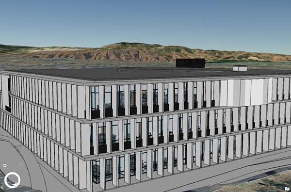

== Building Scene Layer

=== Overview

Building content is derived from a Building Information Modeling (BIM). BIM is a best-practice process for optimizing 
design and construction. BIM processes can produce 3D virtual representations of real-world assets that are commonly 
used for construction, documentation, and evaluation. BIM processes are applied in multiple domains including architecture, 
buildings, energy, utilities, and transportation. A building scene layer can represent the 3D model aspect of BIM structuring 
disciplines such as architectural or piping, and its categories like windows or walls.

*Example of a Building Scene Layer*

[#img_buildingSceneLayer,reftext='{figure-caption} {counter:figure-num}']
.Example of a Building Scene Layer


==== Building Scene Layer Structure

The building scene layer contains discipline and category layers as sublayers which represent a building and its assets. 
Building scene layers can be used to create a scene layer package (*.slpk) or an I3S service. A building scene layer contains 
the following:

- [Layer description](layer.bld.md)
- [Sublayers](sublayer.bld.md)
- [Statistics](statsummary.bld.md)

*Example of building scene scene layer structure*

```
.<host>/SceneServer/layers
	+-- layers
|  +-- 10 (3dSceneLayer.json for layer10, layerType ='building' )
|  |  +-- statistics
|  |  |   +-- summary.json
|  |  +-- sublayers
|  |  |  +--0 (3dSceneLayer.json for layer0, layerType='3DObject')
|  |  |  |  +--nodes
|  |  |  |  |  +--root
|  |  |  |  |  |  +--3dNodeIndexDocument.json
|  |  |  |  |  |  +--geometries (...)
|  |  |  |  |  |  +--attributes (...)
|  |  |  |  |  +--0
|  |  |  |  |  |  +--3dNodeIndexDocument.json
|  |  |  |  |  |  +--geometries (...)
|  |  |  |  |  |  +--attributes (...)
|  |  |  |  |  +--(...)
|  |  |  |  +--statistics
|  |  |  +--1 (3dSceneLayer.json for layer1, layerType='3DObject')
|  |  |  |  +-- (...)
|  |  |  +--(... , layerType='3DObject')
```
==== HTTP API Overview

The following API methods are available for Building Scene Layer:

[width="90%",options="header"]
|===
|Method|Example
|To query SceneLayer document|http://my.server.com/layers/{layerId}
|To query attribute, statistics, documents|http://my.server.com/layers/{layerId}/statistics/{AttribKey} 
|To query  NodePage  document|http://my.server.com/layers/{layerId}/nodepages/{firstNodeIdInPage} 
|To query  Geometry  Buffer|http://my.server.com/layers/{layerId}/nodes/{resourceID}/geometries/0 
|To query  Attribute  Buffer|http://my.server.com/layers/{layerId}/nodes/{resourceID}/attributes/{AttribKey}  Node:  {AttribKey}  is listed at  scenelayer.attributeStorageInfo[].key 
|===

=== Building Scene Layer

==== Building scene layer structure

A building scene layer represents a 3D BIM model as a single layer composed of sublayers. A building scene layer is 
organized in discipline layers (groups) such as Architectural, Electrical, Mechanical, Piping and Structural and category 
layers representing content such as walls or windows. A building scene layer may contain an overview.

The concept of a group (i.e. `layerType='group'`) has been added to organized sublayers into a nested tree structure 
that can be reflected in the table of content of 3D Clients. If a building scene layer does not contain an overview, 
the structure should not include an overview or full model, only the disciplines directly.

Please note that:

- Groups and sublayers may be referenced **once** (e.g. a sublayer may not be in multiple groups).
- Groups and sublayers do not have any resource associated with them.
- Sublayer resources are located in the sublayers of the building scene layer: layers/{bim_layer_id}/sublayers/{sub_layer_id}/....

Since a building scene layer may have an associated featureService, care must be taken to match building scene layer 
sublayer IDs with the service. In practice, if the building scene layer has n sublayers numbered [0,n-1] they need to 
match the featureService sublayers IDs. Any group layers ID in the scene layer need to be greater.

``` 
+-- layers
|  +-- 10 (3dSceneLayer.json for layer10, layerType ='building' )
|  |  +-- statistics
|  |  |   +-- summary.json
|  |  +-- sublayers
|  |  |  +--0 (3dSceneLayer.json for layer0, layerType='3DObject')
|  |  |  |  +--nodes
|  |  |  |  |  +--0
|  |  |  |  |  |  +--3dNodeIndexDocument.json
|  |  |  |  |  |  +--geometries (...)
|  |  |  |  |  |  +--attributes (...)
|  |  |  |  |  +--1
|  |  |  |  |  |  +--3dNodeIndexDocument.json
|  |  |  |  |  |  +--geometries (...)
|  |  |  |  |  |  +--attributes (...)
|  |  |  |  |  +--(...)
|  |  |  |  +--statistics
|  |  |  +--1 (3dSceneLayer.json for layer1, layerType='3DObject')
|  |  |  |  +-- (...)
|  |  |  +--(... , layerType='3DObject')

```

==== Building scene layer service:
The service definition is identical to other scene layer service definitions and will list a single layer (the BIM layer) e.g:
``` js
{
  "serviceName" : "Esri Campus",
  "serviceVersion" : "1.6"
  "supportedBindings" : "REST"
  "layers":
  [
    {
     "id" : 10,
     "layerType" : "Building"
     // ... 
     // building scene layer JSON definitions (see example below)
     // ...
    }
  ]
}
```

==== Notes on _City_ scale building scene layer:

Building scene layer is not envisioned to represent many buildings (e.g. a city). In this case, a single `3DObject` 
layer will be used as a placeholder to visualize and select individual building scene layers. Once a building is selected, 
its matching building scene layer will be open.

**Edits**
- group/layer names **must be unique**. 
- capabilities that have been removed
  - `sublayers.href` and `groups.href` have been removed in favor of IDs
  - Removed `fullExtent` from `group` object
- Added backed `modelName`.
- Added statistics

**TBD**
- Update portal item JSON with mapping between FeatureServer layer ids and BIM SL id !?

==== Related:

[bld::statsummary](statsummary.bld.md)

==== Properties

[width="90%",options="header"]
|===
| Property | Type | Description 
| **id** | integer | Identifier for the layer. Building scene layer id is not in the same namespace as sublayer id. **Important**: clients should **not** assume it will be `0`.
| **name** | string | Layer name.
| **version** | string | Version of building scene layer.
| alias | string | Alias of the layer name. Can be empty if alias and name are identical.
| **layerType** | string | <div>Must be:<ul><li>`Building`</li></ul></div>
| description | string | Description for the layer.
| copyrightText | string | Copyright information to be displayed.
| **fullExtent** | [fullExtent](fullExtent.cmn.md) | 3d extent. If `layer.fullExtent.spatialReference` is specified, it **must** match `layer.spatialReference`.
| **spatialReference** | [spatialReference](spatialReference.cmn.md) | The spatialReference of the layer including the vertical coordinate system. WKT is included to support custom spatial references.
| heightModelInfo | [heightModelInfo](heightModelInfo.cmn.md) | An object containing the vertical coordinate system information.
| **sublayers** | [sublayer](sublayer.bld.md)[] | List of sublayers or group of sublayers.
| filters | [filter](filter.bld.md)[] | Array of filters defined for the building scene layer.
| activeFilterID | string | Global ID, filter ID of the currently active filter for the building scene layer.
| statisticsHRef | string | url to statistic summary for the BIM layer. [statistics/summary.json](statsummary.md)
|===

*Note: properties in **bold** are required*

==== Examples 

===== Example: Building Scene Layer 

```json
 {
  "id": 10,
  "name": "esri_campus",
  "layerType": "Building",
  "alias": "Esri Campus 2018",
  "version": "1.6",
  "spatialReference": {
    "wkid": 4326,
    "latestWkid": 4326
  },
  "fullExtent": {
    "xmin": -117.855689264791,
    "ymin": 32.5702577626442,
    "xmax": -116.87086222794,
    "ymax": 34.1460567673275,
    "zmin": 0.1,
    "zmax": 50.0,
    "spatialReference": {
      "wkid": 4326,
      "latestWkid": 4326
    }
  },
  "statisticsHRef": "statistics/summary",
  "sublayers": [

    {
      "id": 0,
      "layerType": "3DObject",
      "name": "overview",
      "alias": "External shell",
      "modelName": "Overview",
      "visibility": true
    },
    {
      "id": 200,
      "layerType": "group",
      "name": "full_model",
      "alias": "Model Complet",
      "modelName": "FullModel",
      "visibility": true,
      "sublayers": [
        {
          "id": 210,
          "layerType": "group",
          "name": "architectural",
          "alias": "Elements d'architecture",
          "modelName": "Architectural",
          "visibility": true,
          "sublayers": [
            {
              "id": 1,
              "layerType": "3DObject",
              "name": "walls",
              "alias": "Murs porteurs",
              "modelName": "Architectural",
              "visibility": false
            },
            {
              "id": 2,
              "layerType": "3DObject",
              "name": "roofs",
              "modelName": "Architectural",
              "alias": "Toiture exterieures",
              "visibility": true
            }
          ]
        },
        {
          "id": 220,
          "layerType": "group",
          "name": "piping",
          "alias": "Tuyauterie",
          "modelName": "Piping",
          "visibility": true,
          "sublayers": [
            {
              "id": 3,
              "layerType": "3DObject",
              "name": "small_pipes",
              "modelName": "Piping",

              "alias": "Petits tuyaux",
              "visibility": true
            },
            {
              "id": 4,
              "layerType": "3DObject",
              "name": "big_pipes",
              "alias": "Conduits (large)",
              "modelName": "Piping",
              "visibility": true
            }
          ]
        }
      ]
    }
  ]
}
 
```

===== Example: Building Scene Layer without overview 

```json
 {
    "id": 0,
    "name": "11 Jay St - 2015",
    "layerType": "Building",
    "alias": "11 Jay St - 2015",
    "version": "1.6",
    "spatialReference": {
        "wkid": 2875,
        "latestWkid": 2875
    },
    "fullExtent": {
        "xmin": 6275739.750599888153,
        "ymin": 2329145.64472599281,
        "xmax": 6275810.25458117947,
        "ymax": 2329220.688075052574,
        "spatialReference": {
            "wkid": 4326,
            "latestWkid": 4326,
            "vcsWkid": 5703,
            "latestVcsWkid": 5703
        },
        "zmin": 396.6794973805014,
        "zmax": 412.033626022210115
    },
    "sublayers": [
        {
            "id": 1,
            "layerType": "3DObject",
            "name": "ElectricalFixtures",
            "alias": "ElectricalFixtures",
            "modelName": "ElectricalFixtures",
            "discipline": "Electrical",
            "visibility": true
        },
        {
            "id": 2,
            "layerType": "3DObject",
            "name": "LightingFixtures",
            "alias": "LightingFixtures",
            "modelName": "LightingFixtures",
            "discipline": "Electrical",
            "visibility": true
        },
        {
            "id": 3,
            "layerType": "3DObject",
            "name": "DuctFitting",
            "alias": "DuctFitting",
            "modelName": "DuctFitting",
            "discipline": "Mechanical",
            "visibility": true
        },
        {
            "id": 4,
            "layerType": "3DObject",
            "name": "Ducts",
            "alias": "Ducts",
            "modelName": "Ducts",
            "discipline": "Mechanical",
            "visibility": true
        },
        {
            "id": 5,
            "layerType": "3DObject",
            "name": "MechanicalEquipment",
            "alias": "MechanicalEquipment",
            "modelName": "MechanicalEquipment",
            "discipline": "Mechanical",
            "visibility": true
        }
    ]
} 
```

=== Defining the Full Extent for a Building Scene Layer

This class allows the applicatin to define the full geographic extent (x,y,z) of the building scene layer.

==== Related:

Class Layer (bld) [bld::layer](layer.bld.md)

==== Properties

[width="90%",options="header"]
|===
| Property | Type | Description 
| spatialReference | [spatialReference](spatialReference.cmn.md) | An object containing the WKID or WKT identifying the spatial reference of the layer's geometry. 
| **xmin** | number | left 
| **xmax** | number | right 
| **ymin** | number | bottom 
| **ymax** | number | top 
| **zmin** | number | lowest elevation 
| **zmax** | number | highest elevation 
|===

*Note: properties in **bold** are required*

==== Example: Building Scene Layer 

```json
 {
  "xmin": -117.855689264791,
  "ymin": 32.5702577626442,
  "xmax": -116.87086222794,
  "ymax": 34.1460567673275,
  "zmin": 0.1,
  "zmax": 50.0,
  "spatialReference": {
    "wkid": 4326,
    "latestWkid": 4326
  }
} 
```

=== Building Scene Layer Sublayer

A building scene layer is composed of an overview and the full model containing discipline and category layer. These layer types are represented as sublayers. A sublayer may contain other layers or sublayers (i.e `group`) to form a nested structure.

==== Related:

Class layer (bld) [bld::sublayer](sublayer.bld.md), [bld::layer](layer.bld.md)

==== Properties

[width="90%",options="header"]
|===
| Property | Type | Description
| **id** | integer | Identifier for this item. **IF** `layerType != 'group'`, resources will be at `/layers/{bim_layer_id}/sublayers/{this.id}/...` 
| **name** | string | Layer name. **Must be unique** per building scene layer 
| alias | string | Alias of the layer name. Can be empty if alias and name are identical. 
| discipline | string | Semantic for work discipline groups which refine the user experience. <div>Possible values are:<ul><li>`Mechanical`</li><li>`Architectural`</li><li>`Piping`</li><li>`Electrical`</li><li>`Structural`</li></ul></div> 
| modelName | string | A fixed string of sublayer information. Used by client applications to define specific behavior for the modelName. See [list of defined modelNames](subLayerModelName.md) for sublayers. 
| **layerType** | string | <div>Possible values are:<ul><li>`group`</li><li>`3DObject`</li><li>`Point`</li></ul></div> 
| visibility | boolean | Visibility of the sublayer. Default is `true` 
| sublayers | [sublayer](sublayer.bld.md)[] | Sublayers contained in this layer.
|===

*Note: properties in **bold** are required*

==== Examples 

===== Example: Building Scene Layer simple group 

```json
 {
  "id": 100,
  "layerType": "group",
  "name": "architectural",
  "alias": "Architecture",
  "modelName": "Architectural",
  "visibility": true,
  "sublayers": [
    {
      "id": 0,
      "layerType": "3DObject",
      "name": "stairs",
      "alias": "Escaliers",
      "visibility": true
    },
    {
      "id": 1,
      "layerType": "3DObject",
      "name": "roof",
      "alias": "Toitures",
      "visibility": true
    }
  ]
} 
```

===== Example: Building Scene Layer simple group with Point sublayer 

```json
 {
  "id": 100,
  "layerType": "group",
  "name": "architectural",
  "alias": "Architecture",
  "modelName": "Architectural",
  "visibility": true,
  "sublayers": [
    {
      "id": 1,
      "layerType": "3DObject",
      "name": "Casework",
      "alias": "Casework",
      "modelName": "Casework",
      "discipline": "Architectural",
      "visibility": true
    },
    {
      "id": 2,
      "layerType": "Point",
      "name": "LocationPoints",
      "alias": "LocationPoints",
      "modelName": "LocationPoints",
      "discipline": "Architectural",
      "visibility": true
    }
  ]
} 
```

=== Building scene layer Statistics

Statistics for all building scene layer sublayers. Captures statistical information for each field in the building scene layer and the sublayers containing this fields.

==== Related:

[bld::layer](layer.bld.md)

==== Properties

[width="90%",options="header"]
|===
| Property | Type | Description
| --- | --- | ---
| **summary** | [attributestats](attributestats.bld.md)[] | Per-attribute statistics for all sublayers
|===

*Note: properties in **bold** are required*

==== Examples 

===== Example: Building Scene Layer statistics 

```json
 {
  "summary": [
    {
      "fieldName": "floor",
      "label": "Etage",
      "mostFrequentValues": [
        1,
        2,
        5,
        4
      ],
      "subLayerIds": [
        0,
        2,
        3,
        5,
        6,
        10
      ]
    },
    {
      "fieldName": "fournitures",
      "label": "Meuble interieur",
      "mostFrequentValues": [
        "chair",
        "table",
        "cubicle",
        "boxes"
      ],
      "subLayerIds": [
        10,
        4,
        5
      ]
    },
    {
      "fieldName": "diameter",
      "label": "Diametre de conduit",
      "min": 0.2566,
      "max": 2.256,
      "subLayerIds": [
        3,
        5
      ]
    }
  ]
} 
```

=== Building scene layer attribute statistics (attributestats)

Concatenated attribute statistics. If needed, the type of the attribute (string or number) may be inferred from `mostFrequentValues` and/or `min`/`max` fields.

==== Related:

[bld::statsummary](statsummary.bld.md)

==== Properties

[width="90%",options="header"]
|===
| Property | Type | Description
| **fieldName** | string | Name of the field.
| label | string | Label of the field name. If label is empty, the label and fieldName are identical.
| modelName | string | A fixed string of building information, similar to a filter. Used by client applications to define specific behavior for the modelName. The [default filter types](description/defaultFilterTypes.bld.0106.md) define the modelName for the attribute statistics.<div>Possible values are:<ul><li>`category`</li><li>`family`</li><li>`familyType`</li><li>`bldgLevel`</li><li>`createdPhase`</li><li>`demolishedPhase`</li><li>`discipline`</li><li>`assemblyCode`</li><li>`omniClass`</li><li>`systemClassifications`</li><li>`systemType`</li><li>`systemName`</li><li>`systemClass`</li><li>`custom`</li></ul></div>
| min | number | Minimum value. Numeric attributes only.
| max | number | Maximum value. Numeric attributes only.
| mostFrequentValues | integer[0:256], string[0:256] | Most frequent value, if applicable for this attribute. Truncated to 256 entries.
| **subLayerIds** | integer[] | List of sublayers where this attribute may be found.
|===

*Note: properties in **bold** are required*

==== Examples 

===== Example: `String` attribute with `modelName` to specify filterable semantic 

```json
 {
  "fieldName": "fournitures",
  "label": "Meuble interieur",
  "modelName": "custom",
  "mostFrequentValues": [
    "chair",
    "table",
    "cubicle",
    "boxes"
  ],
  "subLayerIds": [
    10,
    4,
    5
  ]
} 
```

===== Example: `Integral` attribute with `modelName` to specify filterable semantic  

```json
 {
  "fieldName": "floor",
  "label": "Etages",
  "modelName": "bldgLevel",
  "mostFrequentValues": [
    1,
    2,
    3
  ],
  "subLayerIds": [
    10,
    15
  ]
} 
```

===== Example: `Float` attribute 

```json
 {
  "fieldName": "diameter",
  "label": "Diametre de conduit",
  "min": 0.2566,
  "max": 2.256,
  "subLayerIds": [
    3,
    5
  ]
} 
```

=== Filter

The filter object can be applied to a building scene layer. Filter allows client applications to reduce the drawn elements of a building to specific types and values.

==== Related:

[bld::layer](layer.bld.md)

==== Properties

[width="90%",options="header"]
|===
| Property | Type | Description 
| **id** | string | Global ID as unique identifier of the filter. 
| **name** | string | Name of the filter. 
| **description** | string | Description of the filter. 
| isDefaultFilter | boolean | Indicates if a filter is the default filter. Clients use the default filter to show the current state of a building. For example, if 'created' is the default filter, all elements in the 'created' phases are drawn, while elements in the 'demolished' phases are invisible.  The default filter is not shown in the UI and does not have Authoring Info. (Can build specific UI for this filter) 
| isVisible | boolean | Defines if a filter is visible within the client application. Used to exclude filters that are overwritten from a group of filters shown in the client application. 
| **filterBlocks** | [filterBlock](filterBlock.bld.md)[1:] | Array of filter blocks defining the filter. A filter contains at least one filter block. 
| filterAuthoringInfo | [filterAuthoringInfo](filterAuthoringInfo.bld.md) | Authoring Info used to generate user interface for authoring clients.
|===

*Note: properties in **bold** are required*

==== Examples 

===== Example: Building Scene Layer 

```json
 {
  "id": "6339E293-B52E-4F49-899A-E177DEC0D644",
  "name": "Default",
  "description": "Filter by all created phases.",
  "isDefaultFilter": true,
  "isVisible": false,
  "filterBlocks": [
    {
      "title": "Created Phase 1",
      "filterMode": {
        "type": "solid"
      },
      "filterExpression": "CreatedPhase=1"
    }
  ]
} 
```

=== Filter Block (filterBlock)

A filter block defines what elements will be filtered with a specific filter mode.  To ensure performance on client applications, it is not recommended to declare multiple filter blocks with the same filter mode. Filter blocks are contained in a filter for a building scene layer. Each filter includes at least one filter block.

==== Related:

[bld::filter](filter.bld.md)

==== Properties

[width="90%",options="header"]
|===
| Property | Type | Description 
| **title** | string | Title of the filter block. 
| **filterMode** | [filterMode](filterMode.bld.md) | Filter mode defines how features are drawn. For example, the filter mode of a filter can be solid or wire frame. 
| **filterExpression** | string | Filter query expression for a building scene layer.
|===

*Note: properties in **bold** are required*

==== Examples 

===== Example: Filter block 

```json
 {
  "title": "Created Phase 1",
  "filterMode": {
    "type": "solid"
  },
  "filterExpression": "CreatedPhase=1"
} 
```

=== Filter Authoring Info for building scene layer (filterAuthoringInfo)

The filter authoring info object contains metadata about the authoring process for creating a filter object. This allows the authoring client to save specific, overridable settings.  The next time it is accessed with an authoring client, the selections are remembered. Non-authoring clients can ignore it.

==== Related:

[bld::filter](filter.bld.md)

==== Properties

[width="90%",options="header"]
|===
| Property | Type | Description
| **type** | string | Declares type or filter authoring info.<div>Must be:<ul><li>`checkbox`: Client UI with checkbox representation for each filter type and filter value.</li></ul></div>
| **filterblocks** | [filterBlockAuthoringInfo](filterBlockAuthoringInfo.bld.md)[] | Array of filter block authoring info.
|===

*Note: properties in **bold** are required*

==== Examples 

===== Example: Building Scene Layer filter authoring info 

```json
 {
  "type": "checkbox",
  "filterblocks": [
    {
      "filterTypes": [
        {
          "filterType": "BldgLevel",
          "filterValues": [
            "3"
          ]
        },
        {
          "filterType": "CreatedPhase",
          "filterValues": [
            "1"
          ]
        }
      ]
    }
  ]
} 
```
