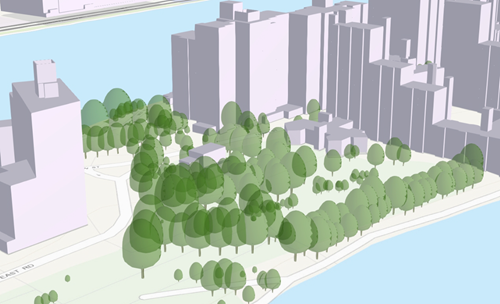

== I3S Point Scene Layer Profile

Use the following table for Requirements Classes.

include::requirements/requirements_class.adoc[]

Use the following table for Requirements, number sequentially.

include::requirements/requirement.adoc[]

=== Introduction

Point scene layers contain point features and their attributes. Point scene layers are often used to visualize large amounts of 3D data such as trees or buildings. Most phenomena that can be visualized by 3D symbols can be displayed using a point scene layer.

[#img_pointscenelayer,reftext='{figure-caption} {counter:figure-num}']
.Example of a point scene layer


=== Point Scene Layer Structure

The point scene layer is structured into a tree of multiple JSON files. Besides storing information in the JSON format, some are also provided as binary buffer. Point scene layers can be used to create a scene layer package (*.slpk) or an I3S service. A point scene layer contains the following:

- Layer description (See Layer Definition: 3DSceneLayerInfo [Point Profile] below)
- Nodes containing Geometry (See Clause 7.6.6.3	Class Geometry in core I3S standard and Attributes (See clause 7.6.4.6 Class attributeStorageInfo in the core I3S document)
- Node Index Document (see Clause 7.6.5.1 Class Node in the core document)
- Statistics (This Class is not defined in the current OGC I3S core document)

==== Example of point scene layer structure

```
.<host>/SceneServer/layers
	+--0 // layer description (named 3dSceneLayer.json in SLPK)
	+-- nodes
	|  +--root
	|  |  +-- attributes
	|  |  |  +--2 
	|  |  |  +--4
	|  |  |  +--8
	|  |  |  +--(...)
	|  |  +-- geometries
	|  |  |  +-- 0
	+--statistics
	|  +-- 2
	|  +-- 4
	|  +-- 8
	|  +-- (...)
```
==== Point Scene Layer HTTP API Overview

The following API methods are available for accessing a Point Scene Layer:

[width="90%",options="header"]
|===
|Method|Example
|To query SceneLayer document|http://my.server.com/layers/{layerId}
|To query attribute, statistics, documents|http://my.server.com/layers/{layerId}/statistics/{AttribKey}
|To query  NodePage  document|http://my.server.com/layers/{layerId}/nodepages/{firstNodeIdInPage}
|To query  Geometry Buffer|http://my.server.com/layers/{layerId}/nodes/{resourceID}/geometries/0
|To query  Attribute  Buffer|http://my.server.com/layers/{layerId}/nodes/{resourceID}/attributes/{AttribKey}  Node:  {AttribKey}  is listed at  scenelayer.attributeStorageInfo[].key
|===

=== Layer Definition: 3DSceneLayerInfo [Point Profile]

The object 3DSceneLayerInfo describes the properties of a layer in a store. Every scene layer contains 3DSceneLayerInfo. For features based scene layers, such as 3D objects or point scene layers, may include the default symbology, as specified in the drawingInfo, which contains stylization information for a feature layer.

==== 3DSceneLayerInfo [Point Profile] Properties

The following table specifies the properties that comprise a 3DSceneLayerInfo [Point Profile] JSON document. Please ote that a property in **bold* type is a mandatory property.

[width="90%",options="header"]
|===
|Property |Type |Description
| **id** | integer | Unique numeric ID of the layer. 
| href | string | The relative URL to the 3DSceneLayerResource. Only present as part of the SceneServiceInfo resource.
| **layerType** | string | The user-visible layer type.<div>Must be:<ul><li>`Point`</li></ul></div>
| spatialReference | [spatialReference](spatialReference.cmn.md) | The spatialReference of the layer including the vertical coordinate system. WKT is included to support custom spatial references.
| heightModelInfo | [heightModelInfo](heightModelInfo.cmn.md) | Enables consuming clients to quickly determine whether this layer is compatible (with respect to its horizontal and vertical CRS) with existing content.
| **version** | string | The ID of the last update session in which any resource belonging to this layer has been updated.
| name | string | The name of this layer.
| serviceUpdateTimeStamp | [serviceUpdateTimeStamp](serviceUpdateTimeStamp.cmn.md) | The time of the last update
| alias | string | The display alias to be used for this layer.
| description | string | Description string for this layer.
| copyrightText | string | Copyright and usage information for the data in this layer.
| **capabilities** | string[] | Capabilities supported by this layer.<div>Possible values for each array string:<ul><li>`View`: View is supported.</li><li>`Query`: Query is supported.</li><li>`Edit`: Edit is defined.</li></ul></div>
| ZFactor | number | ZFactor to define conversion factor for elevation unit.
| cachedDrawingInfo | [cachedDrawingInfo](cachedDrawingInfo.cmn.md) | Indicates if any stylization information represented as drawingInfo is captured as part of the binary mesh representation.  This helps provide optimal client-side access. Currently the color component of the drawingInfo is supported.
| drawingInfo | [drawingInfo](drawingInfo.cmn.md) | An object containing drawing information.
| elevationInfo | [elevationInfo](elevationInfo.cmn.md) | An object containing elevation drawing information. If absent, any content of the scene layer is drawn at its z coordinate.
| popupInfo | [popupInfo](popupInfo.cmn.md) | PopupInfo of the scene layer.
| disablePopup | boolean | Indicates if client application will show the popup information.
| **store** | [store](store.psl.md) | The store object describes the exact physical storage of a layer and enables the client to detect when multiple layers are served from the same store.
| fields | [field](field.cmn.md)[] | A collection of objects that describe each attribute field regarding its field name, datatype, and a user friendly name {name,type,alias}. It includes all fields that are included as part of the I3S layer as derived from a source input feature layer.
| attributeStorageInfo | [attributeStorageInfo](attributeStorageInfo.cmn.md)[] | Provides the schema and layout used for storing attribute content in binary format in I3S.
| statisticsInfo | [statisticsInfo](statisticsInfo.cmn.md)[] | Contains the statistical information for a layer.
|===

==== Example: 3D Scene Layer info for point scene layer

 {
    "id": 0,
    "version": "39054BC8-A656-489C-B574-A717BC399259",
    "name": "Trees_Portland_AllTypes",
    "serviceUpdateTimeStamp": {
        "lastUpdate": 1543373967000
    },
    "href": "./layers/0",
    "layerType": "Point",
    "spatialReference": {
        "wkid": 4326,
        "latestWkid": 4326,
        "vcsWkid": 105790,
        "latestVcsWkid": 3855
    },
    "heightModelInfo": {
        "heightModel": "gravity_related_height",
        "vertCRS": "EGM2008_Geoid",
        "heightUnit": "meter"
    },
    "ZFactor": 0.30480060960121924,
    "alias": "Trees_Portland_AllTypes",
    "description": "Trees_Portland_AllTypes",
    "copyrightText": "",
    "capabilities": [
        "View",
        "Query"
    ],
    "elevationInfo": {
        "mode": "relativeToGround",
        "featureExpression": {
            "value": 0
        },
        "unit": "us-foot"
    },
    "drawingInfo": {
        "renderer": {
            "type": "uniqueValue",
            "styleName": "EsriRealisticTreesStyle",
            "field1": "type",
            "visualVariables": [
                {
                    "type": "sizeInfo",
                    "field": "height",
                    "axis": "height",
                    "valueUnit": "feet"
                },
                {
                    "type": "sizeInfo",
                    "field": "diameter",
                    "axis": "widthAndDepth",
                    "valueUnit": "feet"
                }
            ]
        }
    },
    "popupInfo": {
        "title": "{name}",
        "mediaInfos": [],
        "fieldInfos": [
            {
                "fieldName": "OBJECTID",
                "visible": true,
                "isEditable": false,
                "label": "OBJECTID"
            },
            {
                "fieldName": "name",
                "visible": true,
                "isEditable": true,
                "label": "Name"
            },
            {
                "fieldName": "TreeFID",
                "visible": true,
                "isEditable": true,
                "label": "Tree Feature ID"
            },
            {
                "fieldName": "description",
                "visible": true,
                "isEditable": true,
                "label": "Description"
            },
            {
                "fieldName": "attribution",
                "visible": true,
                "isEditable": true,
                "label": "Attribution/Source"
            }
        ],
        "popupElements": [
            {
                "fieldInfos": [
                    {
                        "fieldName": "OBJECTID",
                        "visible": true,
                        "isEditable": false,
                        "label": "OBJECTID"
                    },
                    {
                        "fieldName": "name",
                        "visible": true,
                        "isEditable": true,
                        "label": "Name"
                    },
                    {
                        "fieldName": "TreeFID",
                        "visible": true,
                        "isEditable": true,
                        "label": "Tree Feature ID"
                    },
                    {
                        "fieldName": "description",
                        "visible": true,
                        "isEditable": true,
                        "label": "Description"
                    }
                ],
                "type": "fields"
            }
        ],
        "expressionInfos": []
    },
    "disablePopup": false,
    "store": {
        "id": "9FA4A13D-2FA3-4F35-B662-D0280C291EB8",
        "profile": "points",
        "resourcePattern": [
            "3dNodeIndexDocument",
            "Attributes",
            "featureData"
        ],
        "rootNode": "./nodes/root",
        "version": "1.6",
        "extent": [
            -122.679052770042688,
            45.520252738397879,
            -122.673035202944419,
            45.5241044684515472
        ],
        "indexCRS": "http://www.opengis.net/def/crs/EPSG/0/4326",
        "vertexCRS": "http://www.opengis.net/def/crs/EPSG/0/4326",
        "nidEncoding": "application/vnd.esri.i3s.json+gzip; version=1.6",
        "featureEncoding": "application/vnd.esri.i3s.json+gzip; version=1.6",
        "attributeEncoding": "application/octet-stream; version=1.6",
        "lodType": "AutoThinning",
        "lodModel": "node-switching"
    },
    "fields": [
        {
            "name": "OBJECTID",
            "type": "esriFieldTypeOID",
            "alias": "OBJECTID"
        },
        {
            "name": "name",
            "type": "FieldTypeString",
            "alias": "Name"
        },
        {
            "name": "TreeFID",
            "type": "FieldTypeString",
            "alias": "Tree Feature ID"
        },
        {
            "name": "description",
            "type": "FieldTypeString",
            "alias": "Description"
        },
        {
            "name": "attribution",
            "type": "FieldTypeString",
            "alias": "Attribution/Source"
        }
    ],
    "attributeStorageInfo": [
        {
            "key": "f_0",
            "name": "OBJECTID",
            "header": [
                {
                    "property": "count",
                    "valueType": "UInt32"
                }
            ],
            "ordering": [
                "ObjectIds"
            ],
            "objectIds": {
                "valueType": "UInt32",
                "valuesPerElement": 1
            }
        },
        {
            "key": "f_1",
            "name": "name",
            "header": [
                {
                    "property": "count",
                    "valueType": "UInt32"
                },
                {
                    "property": "attributeValuesByteCount",
                    "valueType": "UInt32"
                }
            ],
            "ordering": [
                "attributeByteCounts",
                "attributeValues"
            ],
            "attributeByteCounts": {
                "valueType": "UInt32",
                "valuesPerElement": 1
            },
            "attributeValues": {
                "valueType": "String",
                "encoding": "UTF-8",
                "valuesPerElement": 1
            }
        },
        {
            "key": "f_2",
            "name": "TreeFID",
            "header": [
                {
                    "property": "count",
                    "valueType": "UInt32"
                },
                {
                    "property": "attributeValuesByteCount",
                    "valueType": "UInt32"
                }
            ],
            "ordering": [
                "attributeByteCounts",
                "attributeValues"
            ],
            "attributeByteCounts": {
                "valueType": "UInt32",
                "valuesPerElement": 1
            },
            "attributeValues": {
                "valueType": "String",
                "encoding": "UTF-8",
                "valuesPerElement": 1
            }
        },
        {
            "key": "f_3",
            "name": "description",
            "header": [
                {
                    "property": "count",
                    "valueType": "UInt32"
                },
                {
                    "property": "attributeValuesByteCount",
                    "valueType": "UInt32"
                }
            ],
            "ordering": [
                "attributeByteCounts",
                "attributeValues"
            ],
            "attributeByteCounts": {
                "valueType": "UInt32",
                "valuesPerElement": 1
            },
            "attributeValues": {
                "valueType": "String",
                "encoding": "UTF-8",
                "valuesPerElement": 1
            }
        },
        {
            "key": "f_4",
            "name": "attribution",
            "header": [
                {
                    "property": "count",
                    "valueType": "UInt32"
                },
                {
                    "property": "attributeValuesByteCount",
                    "valueType": "UInt32"
                }
            ],
            "ordering": [
                "attributeByteCounts",
                "attributeValues"
            ],
            "attributeByteCounts": {
                "valueType": "UInt32",
                "valuesPerElement": 1
            },
            "attributeValues": {
                "valueType": "String",
                "encoding": "UTF-8",
                "valuesPerElement": 1
            }
        }
    ],
    "statisticsInfo": [
        {
            "key": "f_1",
            "name": "name",
            "href": "./statistics/f_1"
        },
        {
            "key": "f_2",
            "name": "TreeFID",
            "href": "./statistics/f_2"
        },
        {
            "key": "f_3",
            "name": "description",
            "href": "./statistics/f_3"
        },
        {
            "key": "f_4",
            "name": "attribution",
            "href": "./statistics/f_4"
        }
    ]
} 
